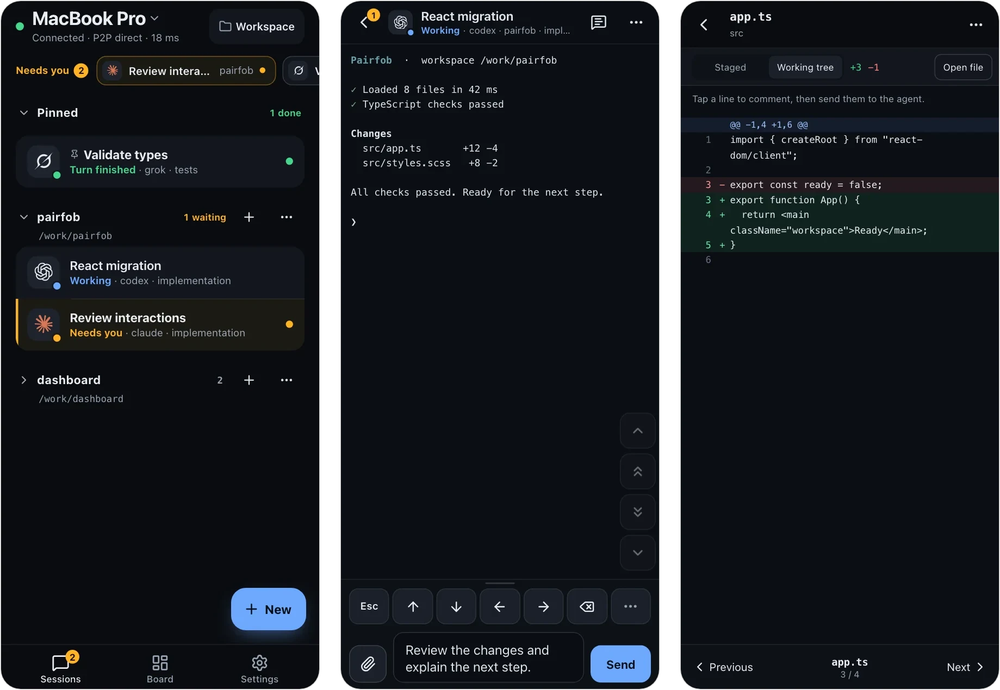

# Pairfob

[](LICENSE)
[](https://pairfob.com)
[](https://pairfob.com/doc/)

**English** | [简体中文](README_zh.md)

**Your [Herdr](https://herdr.dev) agents, on your phone.** Codex, Claude, Grok
and the rest keep running on your computer; after pairing once, a phone, tablet
or another computer opens **the same live sessions**, not copies. The computer
dials out, so there are no inbound ports and no VPN, and the session is
end-to-end encrypted.



## Quick start

macOS or Linux, with Herdr installed (the installer offers to install it if
missing).

```sh
curl -fsSL https://pairfob.com/install.sh | sh
pairfob pair
```

On the phone, open [pairfob.com/pair](https://pairfob.com/pair) and scan, then
press Enter once on the computer to admit it. Add it to your Home Screen and you
are done. Full walkthrough: [Get started](https://pairfob.com/doc/start).

Already living in Herdr? `herdr plugin install arronKler/pairfob` adds
**Pairfob: Pair a device** to Herdr's action menu and installs the same verified
binary on first use. See [`plugin/herdr/`](plugin/herdr/README.md).

## What you can do from the phone

- **Respond when an agent needs you.** A **Needs you** strip and optional push
  notifications surface waiting agents; one tap opens the exact prompt.
- **Work in the live session.** **Auto** picks per session between **Control**
  (terminal view + system keyboard, dictation and a keypad), **Terminal** (the
  real PTY, for vim and full-screen TUIs) and **Chat** (message the agent and
  read its replies).
- **Review changes.** Browse files, read git status and diffs, comment on diff
  lines and send the comments to the agent.
- **Hand files to the agent.** Upload photos, PDFs and other files over P2P and
  insert their workspace paths into the draft.
- **Shape the workspace.** Start conversations, tabs, splits and worktrees, and
  see a tab's real pane layout on the **Board**. Controls only appear when the
  computer supports them.
- **Several computers, several devices.** One phone can switch between
  computers; each computer can have several paired devices. Named Herdr
  sessions (`herdr --session <name>`) are on by default; see
  [Named Herdr sessions](https://pairfob.com/doc/app#named-herdr-sessions).
- **Keep an eye on quota.** Subscription allowance for Codex, Claude Code,
  Copilot, Cursor, Grok and more, collected on the computer.

The phone UI speaks English and 中文. Details: [Using the app](https://pairfob.com/doc/app).

## Security

- **Pairing** uses SPAKE2+ with a code both sides confirm; session keys are
  hardened with Argon2id.
- **Keys** live only on the computer and the paired device. The relay at
  `pairfob.com` forwards ciphertext frames it cannot read.
- **Direct when possible.** An established session upgrades to a WebRTC
  DataChannel and keeps the relay as fallback.
- **Nothing exposed.** The computer only dials out; Herdr is never reachable
  from the internet.

See [What the relay cannot see](https://pairfob.com/doc/security) and report
vulnerabilities privately via [SECURITY.md](SECURITY.md).

## Requirements

| | |
| --- | --- |
| Computer | macOS or Linux (Windows is not supported) |
| Herdr | 0.8 or newer; the installer can install pinned 0.8.2 |
| Herdr plugin | Herdr 0.8.2 or newer |
| Close a workspace from the phone | Herdr 0.9.0 or newer |
| Phone / tablet | A current mobile browser; installable as a PWA |

## Computer commands

```sh
pairfob                     # status; starts the daemon if it is not running
pairfob pair                # pair a phone, tablet, or another computer
pairfob list                # paired devices
pairfob forget 1            # unpair by index or name
pairfob doctor              # diagnose this computer (never changes anything)
pairfob setup               # check, optionally install, and start Herdr
pairfob update              # latest release, then restart the service
pairfob quota-setup-claude  # enable Claude subscription quota collection
pairfob service status      # login service: start / stop / restart / install / uninstall
```

A second computer runs the same installer; pair it from the phone with
**Settings → Switch computer → Add a computer**. Machines that Herdr already reaches over
SSH can be added from the phone's **Computers** page without a pairing code.
Everything else: [Computer commands](https://pairfob.com/doc/cli).

## How it works

```
phone  --HTTPS/WSS pairfob.v2-->  pairfob.com (Worker + Durable Object)
pairfob --outbound WSS---------->  same room  --opaque FWD-->  phone
          \-- WebRTC DataChannel after authenticated setup --/
pairfob --loopback-------------->  Herdr
```

The phone reads the rendered pane and sends keys back to the PTY; it is not a
terminal emulator of its own. `pairfob.com` is the project's official instance.
Protocol specs live in [`proto/`](proto/), including
[direct transport](proto/direct-transport.md).

| Path | What it is |
| --- | --- |
| `cmd/pairfob` | the computer daemon and CLI |
| `internal/` | pairing, sessions, RPC, Herdr adapter, protocol primitives |
| `pwa/` | the phone app (React + TypeScript, built with bun) |
| `workers/pairfob-origin` | the relay: Cloudflare Worker + Durable Object |
| `site/` | homepage and [documentation](https://pairfob.com/doc/) sources |
| `proto/` | frozen envelope, RPC schema and test vectors |
| `plugin/herdr` | Herdr plugin entrypoints |

## Develop

```sh
(cd pwa && bun install --frozen-lockfile)
./scripts/dev-up.sh     # local origin + pairfob + PWA on loopback
./scripts/verify.sh     # full gate: Go, PWA, Worker, site tests and builds
./scripts/dev-down.sh
```

Set `PAIRFOB_DEV_FAKE_RUNTIME=1` for demo data without Herdr. Real-phone
testing, verification scope, protocol invariants and releases:
[`docs/develop.md`](docs/develop.md).

## Contributing

Issues and pull requests are welcome at
[github.com/arronKler/pairfob](https://github.com/arronKler/pairfob). Run the
checks that match your change (see [`docs/develop.md`](docs/develop.md#verification))
and list them in the PR. The envelope, vectors and RPC fields under `proto/`
are frozen by design; please open an issue before proposing a change there.

## Star History

<a href="https://www.star-history.com/?repos=arronkler%2Fpairfob&type=date&legend=top-left">
 <picture>
   <source media="(prefers-color-scheme: dark)" srcset="https://api.star-history.com/chart?repos=arronkler/pairfob&type=date&theme=dark&legend=top-left" />
   <source media="(prefers-color-scheme: light)" srcset="https://api.star-history.com/chart?repos=arronkler/pairfob&type=date&legend=top-left" />
   
 </picture>
</a>

## License

[Apache License 2.0](LICENSE). See [NOTICE](NOTICE).
