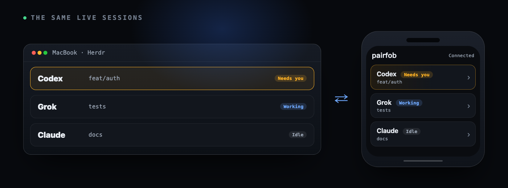

# Pairfob

[](LICENSE)
[](https://pairfob.com)

[English](README.md) | **简体中文**

Pairfob 是 [Herdr](https://herdr.dev) 的手机端。Codex、Claude、Grok 继续在你
的电脑上跑，手机打开的是同一批活着的会话。配对一次即可。电脑主动向外拨号
——不需要入站端口，不需要 Tailscale。



## 功能一览

- **同一个会话，不是副本。** 手机读取渲染好的终端画面，把按键发回 PTY；
  两边始终是同一个会话。
- **端到端加密。** SPAKE2+ 配对，配对码经双方验证，会话密钥用 Argon2id
  加固。密钥只存在于电脑和已配对设备上；中继转发的密文它自己读不懂。
- **能直连就直连。** 会话建立后会在后台尝试升级为 WebRTC DataChannel
  直连，中继保留为兜底。
- **只出不上。** 电脑只向外拨号；不开入站端口，不需要 VPN。
- **三种面板模式。** 控制（默认的手机友好界面）、终端（真实 PTY）、对话
  （和 Agent 发消息）。
- **工作区检查。** 在手机上浏览文件、查看 git status、diff 和分支，
  全部只读。
- **可选通知。** Agent 等你确认或完成任务时推送提醒。
- **中文 / English。** 手机端跟随浏览器语言，也可在设置里固定语言。

## 安装

macOS 或 Linux。Herdr 0.7 及以上。

```sh
curl -fsSL https://pairfob.com/install.sh | sh
pairfob pair
```

也可以把 Pairfob 装成 Herdr 社区插件（Herdr 0.8.2 及以上）：

```sh
herdr plugin install arronKler/pairfob
herdr plugin action invoke pair --plugin pairfob
```

首次执行 **Pair a device** 动作时，会安装同一个经过校验的独立二进制和用户
服务，然后在 Herdr 的交互浮层里打开配对流程。卸载插件只移除 Herdr 里的
入口；Pairfob 本身和已配对设备的状态仍然独立存在。见
[`plugin/herdr/`](plugin/herdr/README.md)。

在手机上打开 [pairfob.com/pair](https://pairfob.com/pair) 扫码。在电脑上按
一次回车，放行这台设备。

文档：[pairfob.com/doc](https://pairfob.com/doc/)（含
[中文版](https://pairfob.com/doc/zh/)）。

## 工作原理

```
phone  --HTTPS/WSS pairfob.v2-->  pairfob.com (Worker + Durable Object)
pairfob --outbound WSS---------->  same room  --opaque FWD-->  phone
          \-- WebRTC DataChannel after authenticated setup --/
pairfob --loopback-------------->  Herdr
```

`pairfob.com` 是本项目的官方实例。它只转发密文帧，读不到会话内容。密钥在
电脑和已配对设备上。会话建立后会在后台尝试 WebRTC 直连升级，中继保留为
兜底。见 [`proto/direct-transport.md`](proto/direct-transport.md)。

## 命令

```
pairfob pair
pairfob list
pairfob forget 1
pairfob update
pairfob doctor
pairfob service status
pairfob version
```

不带子命令时，`pairfob` 在 daemon 已运行时打印简短状态，否则启动它。
`pair`、`list`、`forget` 通过 `$PAIRFOB_STATE_DIR/pairfob.sock`（0600）
和 daemon 通信；`forget` 也接受设备名。`pairfob service` 管理登录服务
（`status`、`start`、`stop`、`restart`、`install`、`uninstall`），
`pairfob help` 列出其余命令。第二台电脑运行同一个安装脚本，然后在手机上用
**设置 → 添加另一台电脑** 配对。

## 开发

```
(cd pwa && bun install)
./scripts/verify.sh
```

`scripts/verify.sh` 是提交改动前的门槛：gofmt、vet、Go 测试（含
race）、漏洞检查、PWA / Worker / 站点测试、typecheck 和生产构建。如果改动
涉及协议原语或测试向量，先用 `go run ./cmd/genvectors` 重新生成。

本地配对走的是与生产同一份 Worker 代码：

```
./scripts/dev-up.sh     # origin + pairfob + PWA on loopback
./scripts/dev-down.sh
```

1. 在电脑上运行 `dev-up.sh` 打印出来的 `pairfob pair` 命令（同一个
   `PAIRFOB_STATE_DIR`）。先显示二维码，配对码作为兜底。
2. 打开 `http://127.0.0.1:18786/pair`。扫码开始，或展开 **输入配对码**。
3. 电脑提示手机已证明配对码后，按回车。手机会自己连上。
4. 打开一张 **等你** 卡片。那就是电脑上的实时 Herdr 会话。

`dev-up.sh` 默认接本机 Herdr。设 `PAIRFOB_DEV_FAKE_RUNTIME=1` 用内置演示
数据；设 `PAIRFOB_HERDR_AUTOSTART=0` 跳过启动 Herdr。除了隔离的测试环境，
永远不要开 `PAIRFOB_DEV_AUTO_ADMIT`。

真机测试不想装本地 CA 的话，可以建一条仅 DNS 的 A 记录，把你控制的域名
指向这台电脑的局域网 IPv4，然后用可选的 DNS-01 模式：

```sh
PAIRFOB_ACME_DOMAIN=pairfob-dev.example.com \
PAIRFOB_ACME_DNS=cloudflare \
PAIRFOB_ACME_EMAIL=you@example.com \
CF_DNS_API_TOKEN='<zone-scoped token>' \
./scripts/dev-up.sh
```

配了域名后 `dev-up.sh` 会自动监听局域网。首次运行会下载固定版本、校验过
和的 `lego` 到 `.dev/tools`；证书和 ACME 账户数据保存在 `.dev/acme`，
续期前会一直复用。支持的 DNS 提供商有 `cloudflare`、`route53`、`alidns`、
`tencentcloud`、`huaweicloud`、`digitalocean`。A 记录不能走 HTTP 代理 /
CDN，否则同一局域网里的设备看不到内网地址。

用 `./scripts/release.sh` 交叉编译可下载的二进制。用
`scripts/pack-origin-assets.sh` 打包 origin（`PAIRFOB_PACK_DL=1` 时包含
`/dl/`）。

## 协议

信封字节保持 `pairfob.v1`（`proto/envelope.md`、`proto/rpc.schema.json`、
`proto/pairfob-vectors.json`）。多路复用控制面是 `pairfob.v2`
（`proto/envelope-v2.md`）。不要改动 HKDF info、AAD、Argon2id、DeviceHello
和内层 RPC 字段。`pair_loc` 永远不进入 SPAKE / Argon2。不存在 `/v1/ws`
origin。

`GetConfig.capabilities` 是一个封闭的十一键对象。变更类操作必须带新的
`operation_id`，且永不自动重试。`unknown_outcome` 只刷新状态，不重放。
路径和 cwd 落在活跃快照根或 `PAIRFOB_ALLOWED_ROOTS` 之外时一律失败关闭。

每个面板可以在 **控制**（默认的手机界面）、**终端**（真实 PTY）和
**对话** 之间切换。产品循环不是终端模拟器：读取渲染好的画面，把按键发回
PTY。

## 参与贡献

欢迎在 [github.com/arronKler/pairfob](https://github.com/arronKler/pairfob)
提 issue 和 PR。提交改动前请先让 `./scripts/verify.sh` 通过。`proto/` 下的
信封、向量和 RPC 字段按设计冻结——改动那里需要单独讨论，不能顺手改；见
[协议](#协议)。

## 许可证

[Apache License 2.0](LICENSE)。见 [NOTICE](NOTICE)。

## 安全

漏洞请私下报告：[SECURITY.md](SECURITY.md)。
